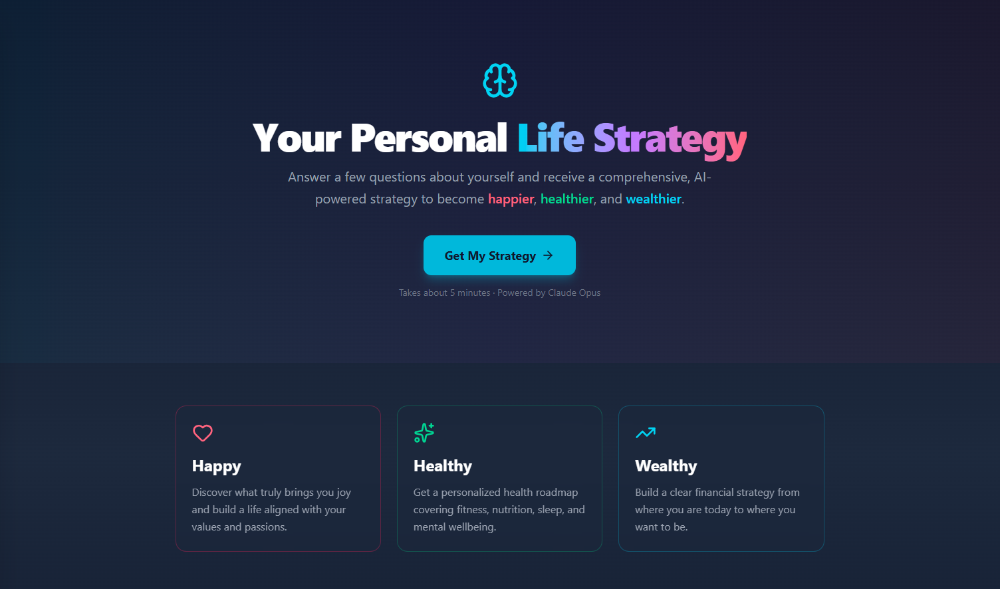

# Life Strategy

Answer a few questions about yourself and receive a comprehensive, AI-powered strategy to become happier, healthier, and wealthier. Powered by Claude Opus.



The app walks you through a 6-step questionnaire covering your health, interests, career, finances, and goals, then streams a personalized strategy back to you in real time.


## Running with Docker

```bash
docker build -t life-strategy .
docker run -p 3000:3000 -e ANTHROPIC_API_KEY=your-key-here life-strategy
```

Then open [http://localhost:3000](http://localhost:3000).

## Local Development

```bash
bun install
cp .env.example .env   # add your ANTHROPIC_API_KEY
bun run dev            # starts on http://localhost:3000
```

Other commands:

```bash
bun run build    # production build (outputs to .output/)
bun run preview  # preview the production build
bun run test     # run tests
```
